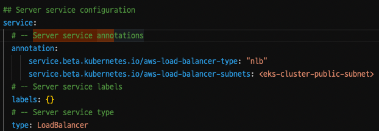
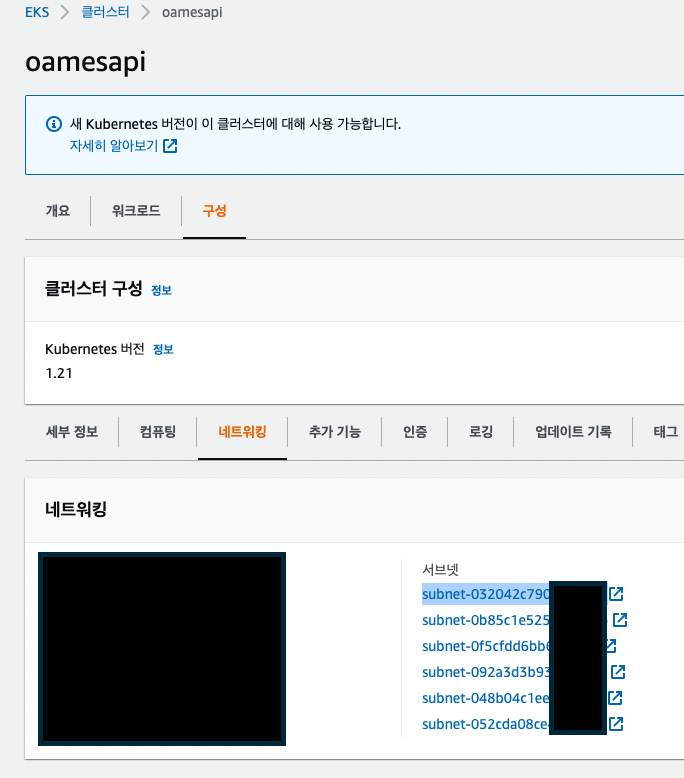

# AWS EKS 사용방법

※[공식문서](https://docs.aws.amazon.com/eks/latest/userguide/install-kubectl.html) 보고 따라함

## kubectl 설치
---

> 이미 쿠버네티스가 깔려있다면 이 과정을 스킵하세요

> Kubernetes 1.22

AWS s3에 있는 쿠버네티스 다운로드

``` curl -o kubectl https://s3.us-west-2.amazonaws.com/amazon-eks/1.22.6/2022-03-09/bin/darwin/amd64/kubectl ```

``` curl -o kubectl.sha256 https://s3.us-west-2.amazonaws.com/amazon-eks/1.17.12/2020-11-02/bin/darwin/amd64/kubectl.sha256 ```

kubectl의 권한 변경

``` chmod +x ./kubectl ```

PATH 등록

``` mkdir -p $HOME/bin && cp ./kubectl $HOME/bin/kubectl && export PATH=$HOME/bin:$PATH ```

``` echo 'export PATH=$PATH:$HOME/bin' >> ~/.bash_profile ```

버전확인

``` kubectl version --short --client ```

## aws cli 설치
---
awscli 설치

``` brew install awscli ```

awscli 인증


``` 
aws configure --profile <생성할 프로필명> 

AWS Access Key ID [None] : [발급받은 IAM의 Access Key ID]
AWS Secret Access Key [None] : [발급받은 IAM의 Secret Access Key]
Default region name [None] : ap-northeast-2[서울 리전]
Default output format [None] : 
```
> --profile 을 사용하지 않으면 전역설정이 되며 
> 
> --profile 옵션으로 사용 시 aws, eksctl 명령어 뒤에 --profile <프로필명>으로 계정 접근

## eksctl 설치
---

macOS에 Homebrew가 아직 설치되어 있지 않은 경우 다음 명령을 사용하여 설치

``` /bin/bash -c "$(curl -fsSL https://raw.githubusercontent.com/Homebrew/install/master/install.sh)" ```

Weaveworks Homebrew 탭을 설치

``` brew tap weaveworks/tap ```

eksctl를 다음 명령으로 설치

``` brew install weaveworks/tap/eksctl ```

eksctl가 이미 설치된 경우 다음 명령을 실행하여 업그레이드

``` brew upgrade eksctl && brew link --overwrite eksctl ```

다음 명령을 사용하여 설치가 성공했는지 테스트

``` eksctl version ```

## eksctl 사용
---

fargate를 사용해서 CloudeFormation을 생성

``` eksctl create cluster --name <생성할 클러스터 명> --region <리전코드> --fargate [--profile <프로필명>]```
> CloudFormation은 무료이며 region-code는 [여기를 참고](https://docs.aws.amazon.com/ko_kr/AWSEC2/latest/UserGuide/using-regions-availability-zones.html)

## argoCD 설치
---
> Docker Desktop에서 AWS EKS에 접속되어있는지 확인하고 시작할 것

Argo CD CLI 설치

``` 
brew tap argoproj/tap 
brew install argoproj/tap/argocd
```
> 로컬에서 Argo CD 명령어를 사용할 수 있어야 하므로 CLI를 깔아준다.

argocd 네임스페이스 생성

``` kubectl create namespace argo ```

<!-- Argo CD 배포

``` kubectl apply -n argocd -f https://raw.githubusercontent.com/argoproj/argo-cd/stable/manifests/ha/install.yaml ```

Argo CD 포트포워드

``` kubectl port-forward svc/argocd-server -n argocd 8080:443 ```

Argo CD 패스워드 확인

``` kubectl -n argocd get secret argocd-initial-admin-secret -o jsonpath="{.data.password}" | base64 -d ```
> ID는 admin으로 고정 -->


helm으로 Argo CD 설치
``` 
kubectl label namespace argocd istio-injection=enabled 

helm repo add argo https://argoproj.github.io/argo-helm

helm repo update

helm fetch argo/argo-cd

tar -xvzf <argo-cd압축파일명>
```

압축 해제 후 argo-cd 폴더 내부 values.yaml 파일 편집


```
annotation:
  service.beta.kubernetes.io/aws-load-balancer-type: "nlb"
  service.beta.kubernetes.io/aws-load-balancer-subnets: subnet-032042c7xxxxxxx, subnet-0b85c1e5xxxxxxxxx, subnet-0f5cfdd6xxxxxxxxx, 

type: ClusterIP -> LoadBalancer로 변경
```
> 서브넷에 있는 코드 2 ~ 3개 정도를 service.beta.kubernetes.io/aws-load-balancer-subnets에 작성


values.yaml파일을 helm으로 ArogCD 설치 

``` helm install argo -n argo argo/argo-cd -f values.yaml ```

argo-agrocd-server의 EXTERNAL-IP의 주소로 들어가서 AgroCD UI확인 가능

``` kubectl get po,svc -n argo ```
> 안되면 10분만 기다렸다가 해보기

Argo CD 패스워드 확인

``` kubectl -n argocd get secret argocd-initial-admin-secret -o jsonpath="{.data.password}" | base64 -d ```
> ID는 admin으로 고정

## ingress-nginx 설치
---
네트워크 로드밸런서 활성화

``` kubectl apply -f https://raw.githubusercontent.com/kubernetes/ingress-nginx/controller-v1.1.3/deploy/static/provider/aws/deploy.yaml ```

-- https://sweetysnail1011.tistory.com/83 를 참고 하며 작성중...

