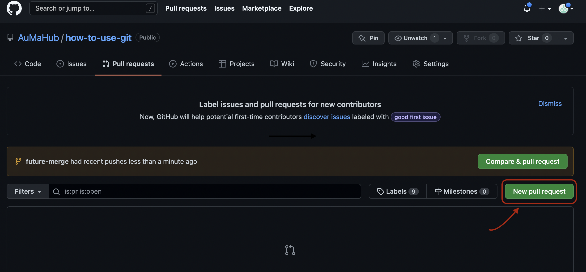
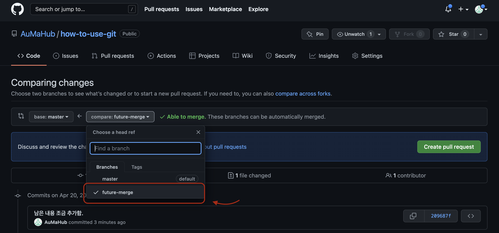
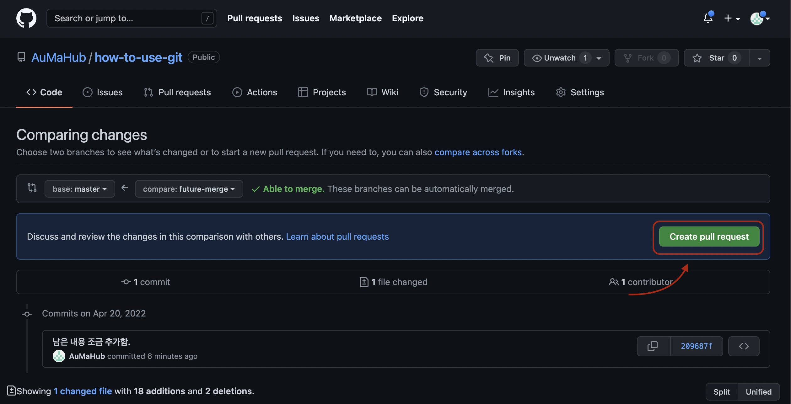
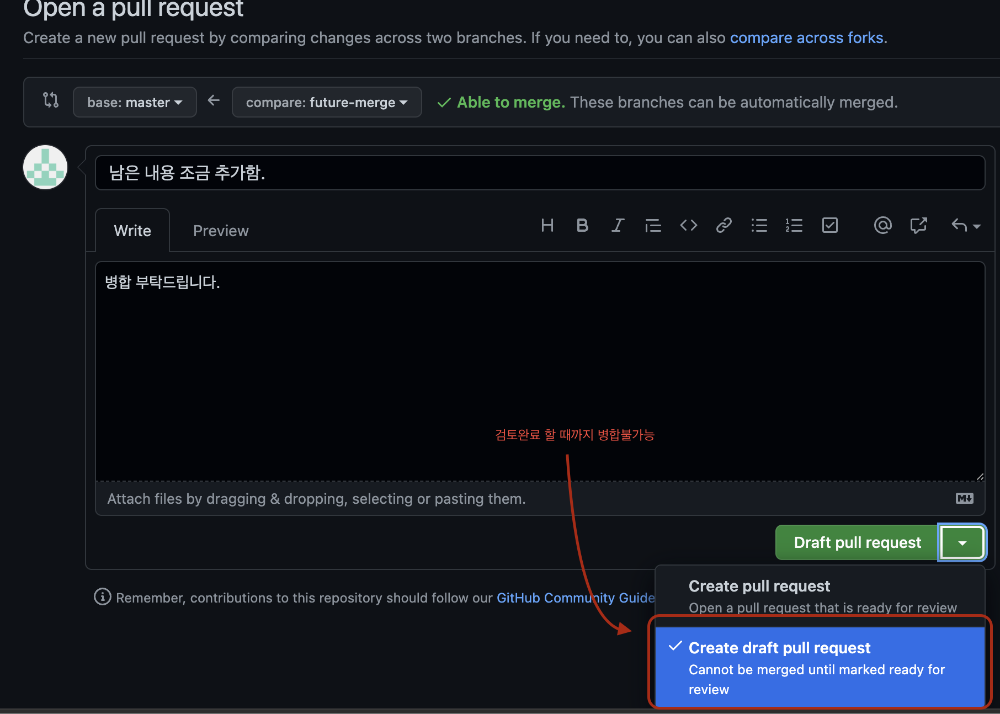
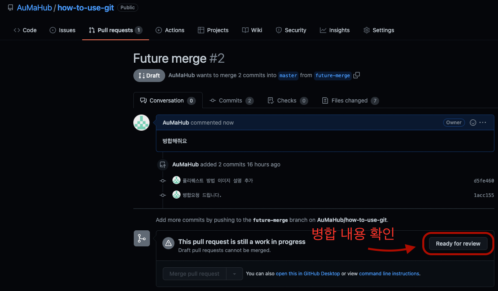
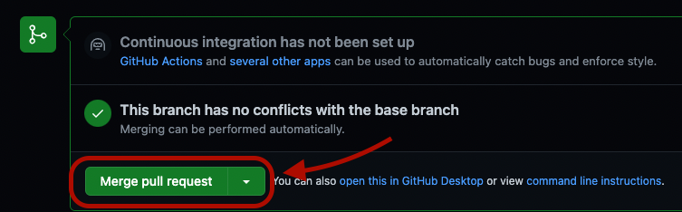
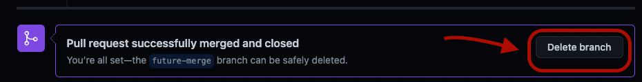

# GIT Pull requests 방법

## 요청하는 사람
---
1. 협업하는 깃 클론 (현재 터미널 위치에 생성됨)
   
   ``` git clone <REPO_URL> ```
2. 브렌치 확인 
   
   ``` git branch ```
   > mac의 경우 q를 눌러 그만 볼 수 있음
3. 브렌치 생성

    ``` git branch <위 명령어에서 나오지 않는 브렌치명> ```
4. 브렌치 체크아웃
   
   ``` git checkout <생성한 브렌치명> ```
5. 변경내용 추가

    ``` git add . ```
6. 변경내용 커밋
   
   ``` git commit -a -m "<남기고 싶은 메시지>" ```
7. 브렌치 업스트림 푸시
   
   ``` git push --set-upstream origin <브렌치명> ```
8. 깃허브에서 pull requests 요청
   
   
   > NEW pull request를 눌러 PR요청 
   
   
   > compare에 생성한 브렌치를 선택
   > 
   > base에 병합하고 싶은 브렌치를 선택
   
   
   > 풀 리퀘스트 생성
   

   > 승인하는 사람이 확인해야 할 중요한 부분을 작성
   > 
   > ```Create pull request```옆 화살표를 눌러 ```Create draft pull request```로 변경 후 등록
   


## 승인해주는 사람
---
   > 승인해주는 사람한테는 풀 리퀘스트가 발생할 시 이메일이 간다.

   > Ready for review를 눌러 병합 할 내용을 확인
   

   > Merge pull request를 누른 후 컨펌하여 병합
   

   > Delete branch를 눌러 브렌치가 쌓이지 않도록 관리
   